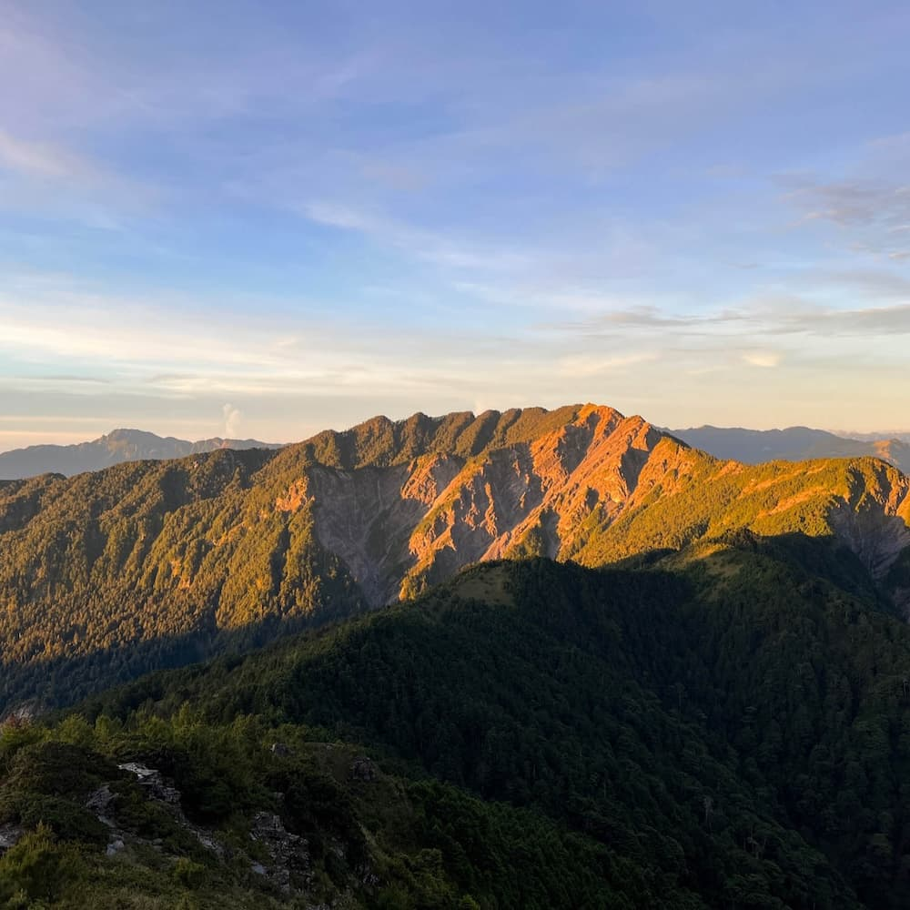
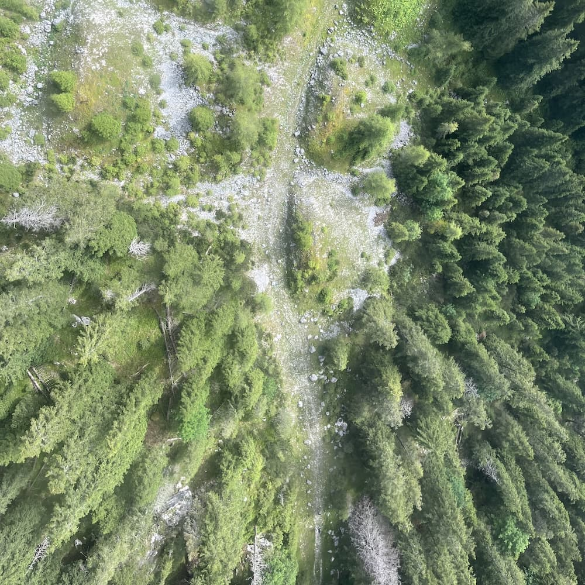
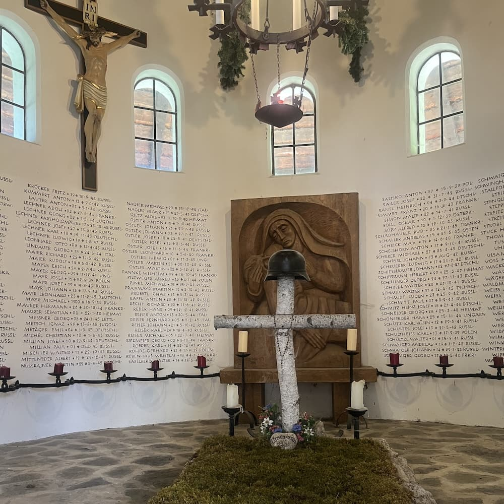
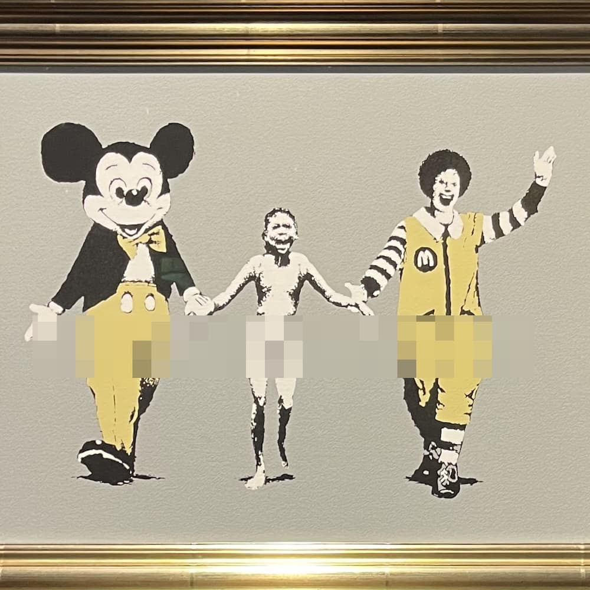
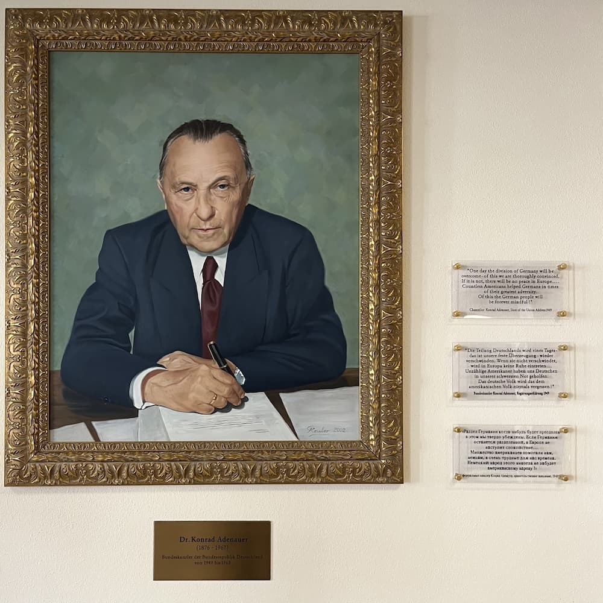
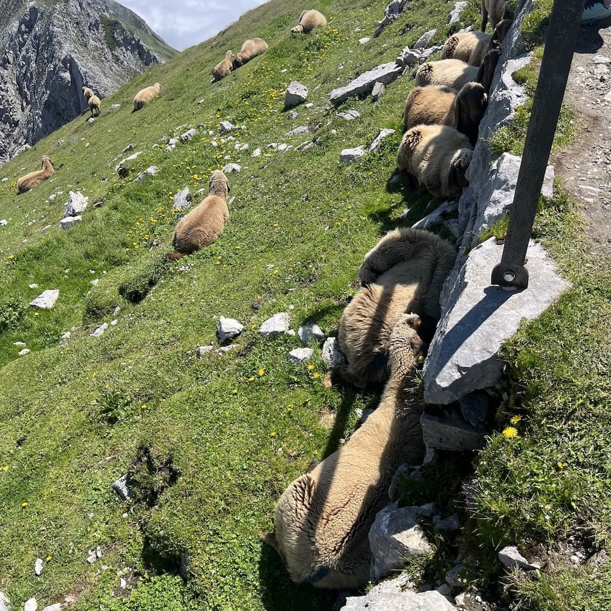
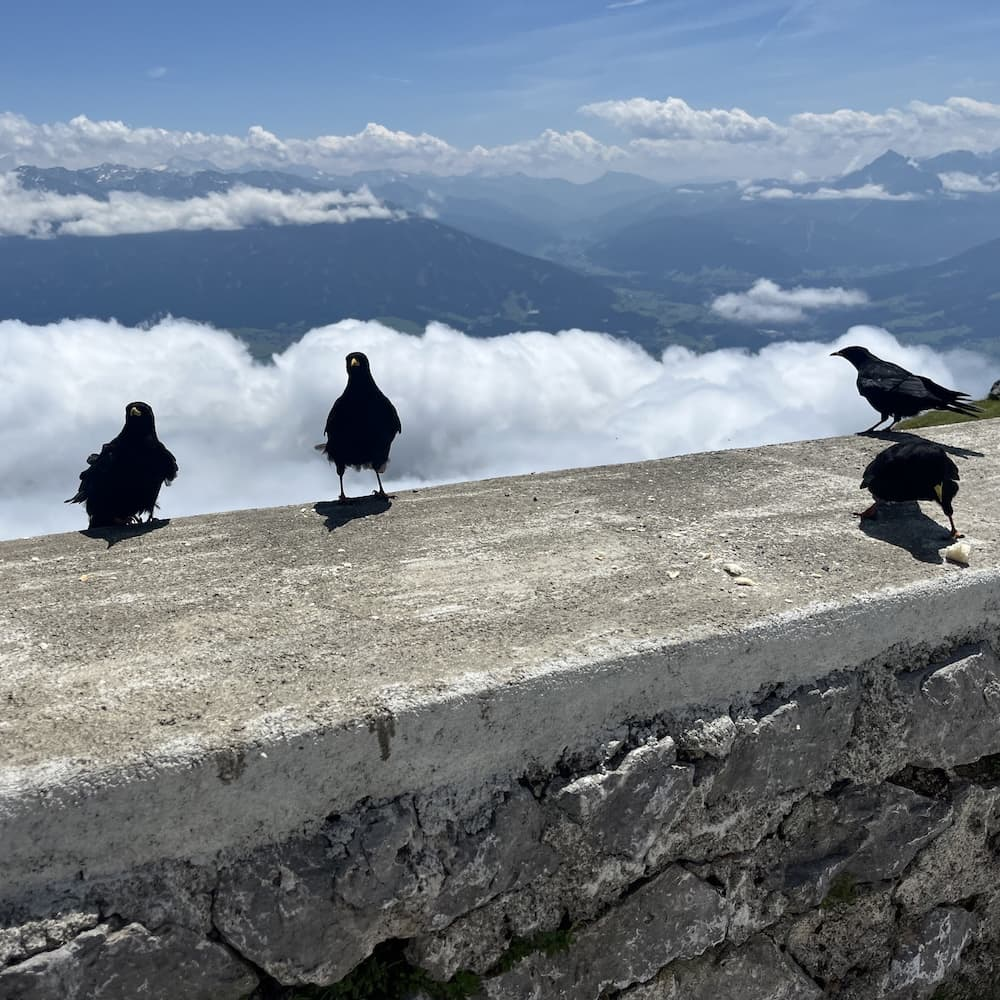
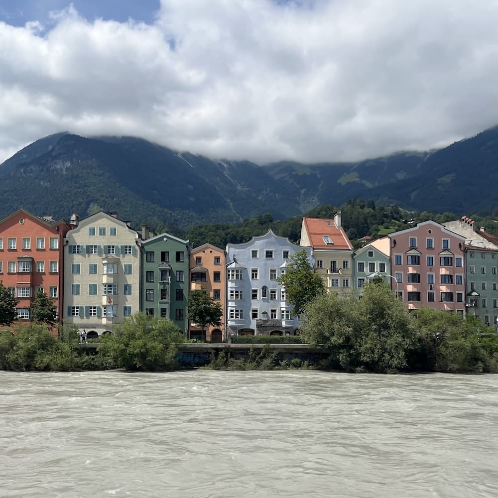
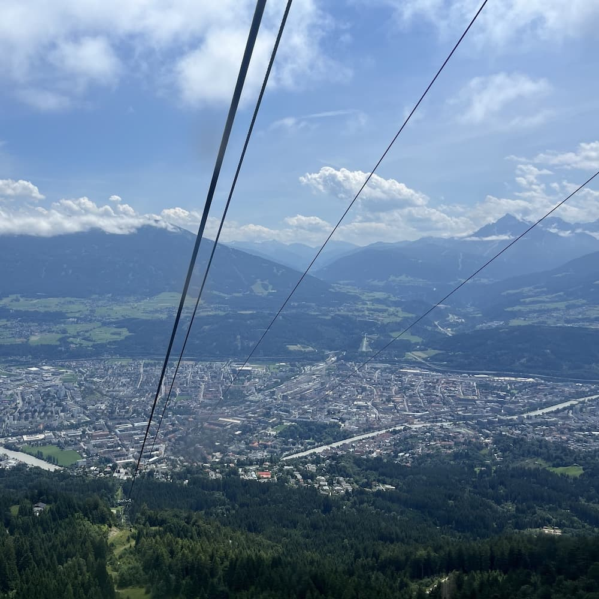

## Introduction
Shaoyi Lai is a Psychological Operations Officer and former dedicated Public Affairs Officer, skilled at enhancing the military’s public image through innovative communications, including press releases, print materials, and digital resources. He excels in building strong relationships with media professionals and social influencers to effectively communicate defense policies.

In addition to his communication expertise, Shaoyi is highly knowledgeable in PRC's Influence Operations and Operations in the Information Environment, leveraging his analytical and strategic skills to counter disinformation and shape public perception in complex geopolitical contexts. His insights into these fields reflect a deep understanding of the dynamic and evolving nature of modern information warfare.

Beyond his professional roles, Shaoyi enjoys exploring his creative side as an amateur website and graphic designer and occasionally dabbles in music, though he humbly acknowledges his limited talents.

[📢 Pronounced Shàoyì in Mandarin](https://voca.ro/12SteQV3fTDZ)

  

        
 &nbsp;Research Interests

        

            <ul class="mt-0">
                <li>Operations in the Information Environment</li>
                <li>Information Advantages and Psychological Operations</li>
                <li>Public Affairs and Media Relations</li>
                <li>China Influence Operations</li>
                <li>Public Opinions on Defense Policies</li>
                <li>Media Literacy and Public Perception</li>
                <li>International Relations and Regional Security</li>
            </ul>
        

    

    

        
 &nbsp;Languages

        

            <ul class="mt-0">
                <li>Taiwanese Mandarin (Native)</li>
                <li>Taiwanese (Fluent)</li>
                <li>English (Advanced to Fluent)</li>
                <li>Japanese (Rudimentary)</li>
            </ul>
        

    

    

        
 &nbsp;Skills

        

            <ul class="mt-0">
                <li>HTML and CSS</li>
                <li>PHP and MySQL</li>
                <li>Data Visualization</li>
                <li>Graphic Design</li>
                <li>Typesetting</li>
                <li>Localization</li>
            </ul>
        

    

<!--more-->
## Education



GPA: 3.9 out of 4

Thesis: <a href="https://hdl.handle.net/11296/583478" target="_blank">Examining the User Attitudes toward Recruitment Center of National Armed Forces with Technology Acceptance Model</a>

Advisor: <a href="https://scholar.google.com/citations?user=kvbTudUAAAAJ&hl=en" target="_blank">Wencheng Fu</a>

Extracurricular Activities

<ul>
 <li>Served as the Chief of Multimedia Products at the <a href="https://n.yam.com/Article/20150703132977" target="_blank" rel="noopener">2015 MND News Summer Camp for High Schoolers</a>, overseeing the production of multimedia content</li>
 <li>Translated Chapter 4, “On the Move”, of the book “<a href="https://teachinglondoncomputing.org/resources/inspiring-computing-stories/computingwithoutcomputers/" target="_blank" rel="noopener">Computing without Computers</a>” (Taiwanese Mandarin title: <a href="http://paperplane-tw.weebly.com/cdc.html" target="_blank" rel="noopener">不用電腦學程式</a>), adapting complex concepts for local readers</li>
 <li>Localized the video game “<a href="https://fullbright.company/localization/" target="_blank" rel="noopener">Gone Home</a>” by The Fullbright Game Company into Taiwanese Mandarin, making it accessible to a broader audience</li>
 <li>Adapted “<a href="https://crowdin.com/project/firefly-iii" target="_blank" rel="noopener">Firefly</a>”, a personal finance management application built on Laravel, for Taiwanese Mandarin speakers, enhancing user experience and accessibility</li>
 </ul>




GPA: 3.5 out of 4

Extracurricular Activities

<ul>
 <li>Served as the Intern Political Warfare Officer in the Cadet Corps, leading various strategic initiatives from Feb. 2011 to Feb. 2012</li>
 <li>Acted as the College Flag Bearer in the Color Guard, representing the college in numerous ceremonial duties from Jul. 2011 to Jan. 2012</li>
 <li>Participated in the 2012 University Communication Basketball Cup as a member of the departmental basketball team in May. 2012</li>
 <li>Represented the Cadet Corps in visits to three prestigious U.S. military institutes (<a href="https://www.vmi.edu/" target="_blank" rel="noopener">VMI</a>, <a href="https://www.westpoint.edu/" target="_blank" rel="noopener">USMA</a>, <a href="https://www.citadel.edu/" target="_blank" rel="noopener">The Citadel</a>) in Aug. 2010, enhancing international military relations</li>
 <li>Led the Rock n’ Roll Club as Director, organizing events and managing club operations from Jul. 2010 to Jul. 2011</li>
 <li>Participated as an assistant performer in <a href="https://www.youtube.com/watch?v=2cFJBkq0c_I" target="_blank">the opening ceremony</a> of the 2009 Summer Deaflympics at Taipei Stadium, Taiwan, in Sep 2009
 <li>Participated as a member of the Fu Hsing Kang Choir, performing in diverse venues from Oct. 2008 to Jun. 2009</li>
 </ul>





## Publications
- **Shu–Min Hou,  Wen-Cheng Fu,  Shao–Yi Lai**. “Exploring Information Warfare Strategies during the Russia–Ukraine War on Twitter.” _The Korean Journal of Defense Analysis_, 35(1):  pp.19 - 44. [DOI](https://doi.org/10.22883/kjda.2023.35.1.002)
 artificial intelligence 
 hybrid war 
 information warfare 
 Twitter 
 Russia–Ukraine war 
 social media 

- **Su-Yu Chou, Shaoyi Lai. 2015**. “The influence of virtual presence—Internet word-of-mouth and the image of the army in disaster relief.” [_The Third Military News Forum_](https://gpi.culture.tw/books/1010402118).
- **Shaoyi Lai, Wenchun Kuo, Jenwei Wei, Chiahou Hung**. 2015. “The current development and future recommendation to the online version of Youth Daily News.” [_The Third Military News Forum_](https://gpi.culture.tw/books/1010402118).
 
## Experience




Responsibilities

<ul>
 <li>Coordinating international subject-matter experts exchanges</li>
 <li>Mandarin Chinese and English Interpreter</li>
 <li>Produce multimedia psychological operation products</li>
 <li>Edit and compose governmental publications</li>
 </ul>
 



<!-- 司令部營輔導長 -->


Responsibilities

<ul>
    <li>Mental health and career path consultant at the Service Battalion</li>
    <li>Civil affairs and public relations within the area of operation</li>
    <li>Media strategist for strengthening a positive military image</li>
</ul>





Responsibilities

<ul>
    <li>Mental health and career path consultant at the Medical Battalion</li>
    <li>Organic and non-organic medical resources integration</li>
    <li>Assist medic-related military training courses</li>
</ul>





Responsibilities

<ul>
 <li>Maintain information advantage and superiority</li>
 <li>Engage with and coordinate civilian news outlets</li>
 <li>Plan administrative affairs and comptroller budgets of the institute</li>
 <li>Integrate Information and digital systems</li>
 <li>Assist manager and campaigns developer with social media platforms</li>
 <li>Aide-de-camp to the spokesperson for the Ministry of National Defense</li>
 </ul>
 





Responsibilities

<ul>
 <li>Produce multimedia psychological operation products</li>
 <li>Edit and compose governmental publications</li>
 <li>Serve as an interpreter in seminars, exercises, and subject-matter expert exchanges</li>
 <li>Provide counseling and aid to active duties facing challenges of civil-to-military adaptation</li>
 <li>Assist the commander in achieving their operational intentions</li>
 <li>Assist international exchange programs</li>
 </ul>
 





Responsibilities

<ul>
    <li>Assist with basic military training for the Army and the Air Force</li>
    <li>Produce multimedia products for significant events such as Parental Weekends, promotion ceremonies, unit documentaries, and service newspapers</li>
    <li>Assist the commander in fulfilling their operational intentions</li>
 </ul>
 





Responsibilities

<ul>
    <li>Compose captions and take photographs at significant political, entertainment, religious, and liberal arts events</li>
    <li>Administrative supports</li>
 </ul>
 


<!-- 

Responsibilities

<ul>
 <li>Serve as an interpreter in seminars, exercises, and subject-matter expert exchanges</li>
 <li>Assist international exchange programs</li>
 </ul>
 

 -->

<!-- 

Responsibilities

<ul>
 <li>Assist administrative tasks in media-embedded operations</li>
 <li>Produce data analysis reports on social media engagement and public opinions</li>
 <li>Conduct press release and press conference exercises</li>
 </ul>
 

 -->

<!-- 
With html code
<ul>
  <li>Coffee</li>
  <li>Tea</li>
  <li>Milk</li>
</ul>



With other shortcodes

  
  
  
  
  
  
  

 -->

 
## Military Certification
- **Program on Terrorism and Security Studies**, George C. Marshall European Center For Security Studies  
- **Psychological Operations Qualification Course Certification**, USAJFKSWCS - Jun 2018 [The [Summary Report](https://report.nat.gov.tw/ReportFront/ReportDetail/detail?sysId=C10700199)] 
- **American Language Course**, Defense Language Institute - Apr 2018
- **Captain Career Course**, Political Warfare Education and Training Center - Dec 2017
- Fire Manager Training, Army Engineering School - Nov 2012
- Advanced Summertime Training, Army Infantry School - Aug 2010
- Basic Summertime Training, Army Infantry School - Aug 2009
- Basic Military Training, Army Infantry School - Aug 2008
  
## Volunteer Activities
- Volunteer at [Yunshui Community Development Association](https://g.co/kgs/2tpvQwh), Chiayi, Taiwan from Aug 2018 to Present
- Music performer at Da-Wo Veterans Home in Jan 2012
- Music performer at Banqiao Veterans Home in Jan 2011
- Music performer at Taoyuan Veterans Home in Sep 2010
- Documentary producer and community service at Da-Ai Indigenous Tribe in Aug 2009

<!-- loop=true -->
## Footprints

Randomly share places I have been to. Hope you like it like I do. 😊  


**🇹🇼Taiwan**

  
  
  <!--  -->
  
  <!--  -->
  
  <!--  -->
  
  


**🇯🇵Japan**

  <!--  -->
  
  <!--  -->
  <!--  -->
  
  
  
  
  
  

**🇺🇸United States**

  <!--  -->
  
  
  <!--  -->
  
  
  
  
  <!--  -->


**🇩🇪Germany**

  
  
  
  
  
  


**🇦🇹Austria**

  
  
  
  
  
  


